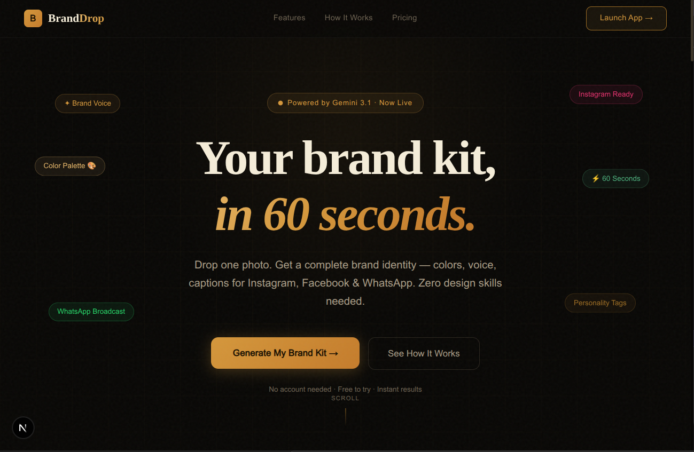

<div align="center">
  

  <br />
  <br />

  <h1>BrandDrop</h1>

  <p><strong>Your brand kit and social media content — in 60 seconds. No website needed.</strong></p>

  <p>
    
    
    
    
    
  </p>

  <p>
    <a href="#-quick-start">Quick Start</a> ·
    <a href="#-features">Features</a> ·
    <a href="#-architecture">Architecture</a> ·
    <a href="#-api-routes">API Routes</a> ·
    <a href="#-project-structure">Project Structure</a>
  </p>
</div>

---

## What is BrandDrop?

BrandDrop is an AI-powered web application that takes a **single business image** and a short description, then generates a complete, downloadable brand and campaign kit — including platform-specific copy, hashtags, and a studio-quality campaign image — tailored for **Instagram, Facebook, and WhatsApp**.

Built specifically for **SMBs in emerging markets** (Nigeria and West Africa) who need professional branding without the budget for agencies or the time to learn design tools.

---

## Features

| Feature | Description |
|---|---|
| **Brand DNA Extraction** | Gemini Vision reads your image and maps colors, typography mood, brand voice, target audience, and personality tags |
| **Multi-Platform Copy** | Platform-specific captions for Instagram (150 words), Facebook (200 words), and WhatsApp broadcast messages |
| **AI Campaign Image** | Studio-quality, text-free 1:1 campaign image generated to match your brand's exact color palette and visual style |
| **Hashtag Strategy** | Curated hashtag sets per platform — mix of niche, mid-tier, and broad reach |
| **One-Click ZIP Export** | All assets (copy + image) bundled into a single `.zip`, organized by platform |
| **Cultural Context** | Campaign themes include local contexts: Owambe/Weekend, Holiday/Sallah, Flash Sale |
| **Zero Auth Required** | No account, no sign-up, no friction — open and generate |

---

## Quick Start

### Prerequisites

- Node.js 18+
- A [Google AI Studio](https://aistudio.google.com/apikey) API key with access to Gemini 3.1 models

### Installation

```bash
# 1. Clone or unzip the project
cd branddrop

# 2. Install dependencies
npm install

# 3. Add your API key
echo "GEMINI_API_KEY=your_key_here" > .env.local

# 4. Run the dev server
npm run dev
```

Open [http://localhost:3000](http://localhost:3000) — the landing page loads first. Hit **"Launch App"** or go to [http://localhost:3000/app](http://localhost:3000/app) to start generating.

---

## The 4-Step Wizard

```
Step 1 — Input          Upload your image + fill in business name, industry, description
     ↓
Step 2 — Brand DNA      AI extracts colors, voice, personality tags, visual style — you review
     ↓
Step 3 — Campaign       Select platforms (IG/FB/WA), pick a campaign theme, optional custom goal
     ↓
Step 4 — Results        Preview all generated content, switch between platform tabs, download ZIP
```

---

## Architecture

### Tech Stack

| Layer | Technology |
|---|---|
| Framework | Next.js 16 (App Router) |
| UI | React 19 |
| Styling | Tailwind CSS v4 |
| Animations | Framer Motion 12 |
| Icons | Lucide React |
| AI | `@google/genai` SDK v1.44 |
| Export | JSZip + FileSaver |

### AI Models

| Model | Used For |
|---|---|
| `gemini-3.1-pro-preview` | Brand DNA extraction (vision) + social media copy generation (JSON mode) |
| `gemini-3.1-flash-image-preview` | Campaign image generation (text → image, Nano Banana 2) |

> **Note on image generation:** `gemini-3.1-flash-image-preview` is text-in / image-out only. It does not support image input alongside image output. Brand DNA extracted in Step 2 is passed as a rich text prompt instead.

---

## API Routes

All routes are server-side Next.js API handlers under `/app/api/`.

### `POST /api/analyze-brand`

Accepts a Base64 image + business context. Returns structured Brand DNA JSON.

**Request body:**
```json
{
  "imageBase64": "...",
  "mimeType": "image/jpeg",
  "businessName": "Adunni Couture",
  "industry": "Fashion & Apparel",
  "description": "..."
}
```

**Response:**
```json
{
  "success": true,
  "brandDNA": {
    "primaryColor": "#2C1810",
    "secondaryColor": "#8B4513",
    "accentColor": "#D4973B",
    "typographyStyle": "Elegant Serif",
    "typographyMood": "Refined and confident",
    "brandVoice": "Luxurious & Refined",
    "targetAudience": "Women 25–45, fashion-forward...",
    "personalityTags": ["Elegant", "Artisan", "Warm", "Aspirational"],
    "visualStyle": "Dark & Luxe",
    "brandEmotion": "Confident elegance",
    "colorRationale": "Rich earth tones evoke craftsmanship..."
  }
}
```

---

### `POST /api/generate-content`

Accepts Brand DNA + campaign config. Returns copy for all selected platforms.

**Request body:**
```json
{
  "brandDNA": { ... },
  "businessName": "Adunni Couture",
  "industry": "Fashion & Apparel",
  "description": "...",
  "platforms": ["instagram", "facebook", "whatsapp"],
  "campaignTheme": "new_launch",
  "customGoal": "Get 50 pre-orders"
}
```

**Response:**
```json
{
  "success": true,
  "content": {
    "instagram": { "bio": "...", "caption": "...", "hashtags": [...] },
    "facebook": { "bio": "...", "caption": "...", "hashtags": [...] },
    "whatsapp": { "statusCaption": "...", "broadcastMessage": "..." }
  }
}
```

---

### `POST /api/generate-image`

Accepts Brand DNA + campaign theme. Returns a Base64-encoded campaign image.

**Request body:**
```json
{
  "brandDNA": { ... },
  "businessName": "Adunni Couture",
  "industry": "Fashion & Apparel",
  "campaignTheme": "new_launch"
}
```

**Response:**
```json
{
  "success": true,
  "imageBase64": "/9j/4AAQSkZJRgAB..."
}
```

---

## Project Structure

```
branddrop/
├── app/
│   ├── page.tsx                    # Landing page (/)
│   ├── layout.tsx                  # Root layout + fonts
│   ├── globals.css                 # CSS variables, dark theme, animations
│   │
│   ├── app/
│   │   └── page.tsx                # Wizard orchestrator (/app)
│   │
│   ├── components/
│   │   ├── StepIndicator.tsx       # Animated 4-step progress bar
│   │   ├── LoadingScreen.tsx       # Orbital spinner with cycling messages
│   │   ├── Step1Input.tsx          # Business details + drag-and-drop upload
│   │   ├── Step2BrandDNA.tsx       # Color swatches + personality tag review
│   │   ├── Step3Campaign.tsx       # Platform toggles + campaign theme picker
│   │   └── Step4Results.tsx        # Tabbed content + image + ZIP download
│   │
│   └── api/
│       ├── analyze-brand/
│       │   └── route.ts            # POST — vision analysis → BrandDNA JSON
│       ├── generate-content/
│       │   └── route.ts            # POST — parallel platform copy generation
│       └── generate-image/
│           └── route.ts            # POST — Nano Banana 2 image generation
│
├── public/
│   └── preview.png                 # Landing page screenshot
│
├── .env.local                      # GEMINI_API_KEY (not committed)
├── package.json
├── tsconfig.json
└── next.config.ts
```

---

## Environment Variables

| Variable | Required | Description |
|---|---|---|
| `GEMINI_API_KEY` | ✅ Yes | Google AI Studio API key. Get one at [aistudio.google.com](https://aistudio.google.com/apikey) |

---

## Roadmap (V2)

- [ ] **User Authentication** — save Brand DNA profiles across sessions
- [ ] **Database Integration** — Supabase or Firebase for generation history
- [ ] **Content Calendar** — generate a full 30-day content plan
- [ ] **Direct Social Posting** — Meta Graph API integration
- [ ] **Payment Gateway** — Paystack / Flutterwave premium tiers

---

## Design Decisions

**Why Gemini 3.1 Pro for text and vision?**
Single model for both the image analysis (multimodal) and copy generation (JSON mode) keeps the pipeline consistent and reduces cold-start latency vs. mixing providers.

**Why not pass the reference photo into image generation?**
`gemini-3.1-flash-image-preview` (Nano Banana 2) is text-in / image-out only — it does not accept image input alongside an image output request. The Brand DNA extracted in Step 2 encodes all the necessary visual direction as structured text.

**Why run content + image generation in parallel?**
`Promise.allSettled` fires both API calls simultaneously. Content generation (~3–5s) and image generation (~8–15s) overlap, cutting total wait time roughly in half.

---

## License

Apache License 2.0 - Copyright 2026 BrandDrop

---

<div align="center">
  <p>Built for Nigerian SMBs · Powered by <strong>Gemini 3.1</strong> · Built by Daniel Toba ✦</p>
</div>